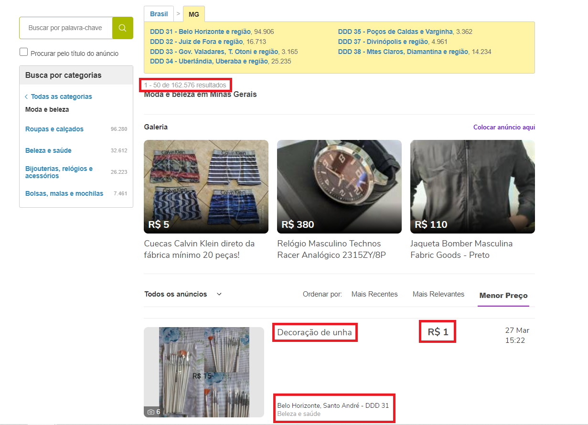

# WEB SCRAPING

## Mas o que é isso?

O método de web scraping consiste em obter dados de uma página web, navegando pelo seu código HTML e capturando os dados que interassam, para posteriormente usa-los em outras aplicações.

Um exemplo da utilização dessa ferramenta pode ser vista quando vamos até um site de vendas de algum produto, e queremos prever o preço desse produto daqui a alguns dias ou meses. Para isso, aplicamos o web scraping para obter os dados dos preços que estão sendo mostrados no site.

No meu caso, vou utilizar o site da OLX para aplicar a técnica.

### Onde tudo começa.

Antes de tudo precisamos ir até a página e visualizar quais dados nos interessa. Neste caso, vou pegar os dados de preço do produto, a sua descrição e o lugar de onde está sendo vendido.

> Para que os dados continuassem os iguais, mesmo que eu atualize a página, tive que orderna-los por cidade, e menor preço, dessa forma obteria os memos números sempre que acesse aquela URL.

