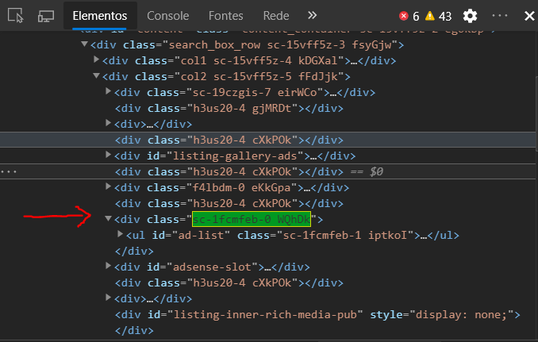
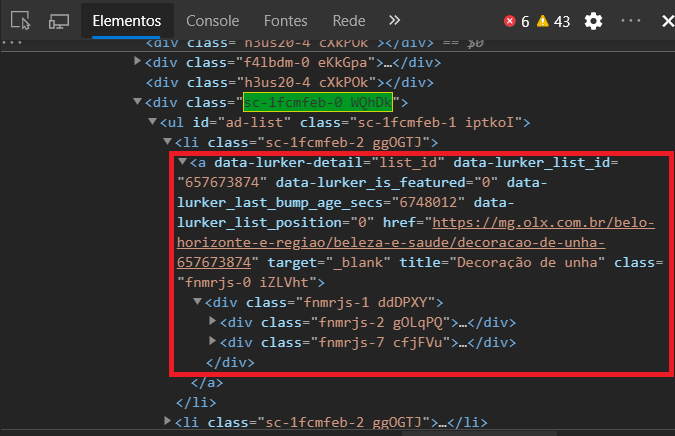

# WEB SCRAPING

## Mas o que é isso?

O método de web scraping consiste em obter dados de uma página web, navegando pelo seu código HTML e capturando os dados que interassam, para posteriormente usa-los em outras aplicações.

Um exemplo da utilização dessa ferramenta pode ser vista quando vamos até um site de vendas de algum produto, e queremos prever o preço desse produto daqui a alguns dias ou meses. Para isso, aplicamos o web scraping para obter os dados dos preços que estão sendo mostrados no site.

No meu caso, vou utilizar o site da OLX para aplicar a técnica.

### Onde tudo começa.

Antes de tudo precisamos ir até a página e visualizar quais dados nos interessa. 
- Preço do produto
- Descrição 
- Localização 
- Nº de páginas

> Para que os dados continuassem os iguais, mesmo que eu atualize a página, tive que orderna-los por cidade, e menor preço, dessa forma obteria os memos números sempre que acesse aquela URL.


### Indentificando os conteúdos na página

Como já localizamos os dados visualmente, agora basta ir no código fonte HTML e indentificar onde eles estão.




Usaremos as classes das tags como endereços para pegarmos o conteúdo expecífico, desta forma separei os endereços em variáveis em um módulo separado do principal.

```
CONTAINER_PAGES_FIRST = 'col2 sc-15vff5z-5 fFdJjk'
CONTAINER_PAGES_SEC = 'sc-jTzLTM sc-ksYbfQ uUqze'
CONTAINER_PAGES_THIRD = 'sc-1mi5vq6-0 gfpAwo'

CONTAINER_MAIN_CARDS_FIRST = 'sc-1fcmfeb-0 WQhDk'
CONTAINER_MAIN_CARDS_SEC   = 'fnmrjs-1 ddDPXY'
```

### Módulos

Os módulos são estruturados da seguinte forma: 

- simple_scraping.py
  - Ele pode ser executado como uma forma muito mais simples de web scraping, ele não te retorna dados, porém são poucas linhas de           comando que podem ser ultilizadas para entender melhor o funcionamento das bibliotecas.
  
- err_handling.py
  - Módulo principal, quande executado interage com os demais módulos e retorna um tabela com todos os dados obtidos
  
- all_def.py
  - Módulo separado com as funções que foram utilizadas, separadas por suas funcionalidades, por exemplo, buscar o texto, a imagem,         gerar a tabela etc.
  
- my_options.py
  - Neste módulo eu incorporei todas as informações estáticas em forma de varáveis, para que eu pudesse apenas importar e usa-las de         forma comum.
